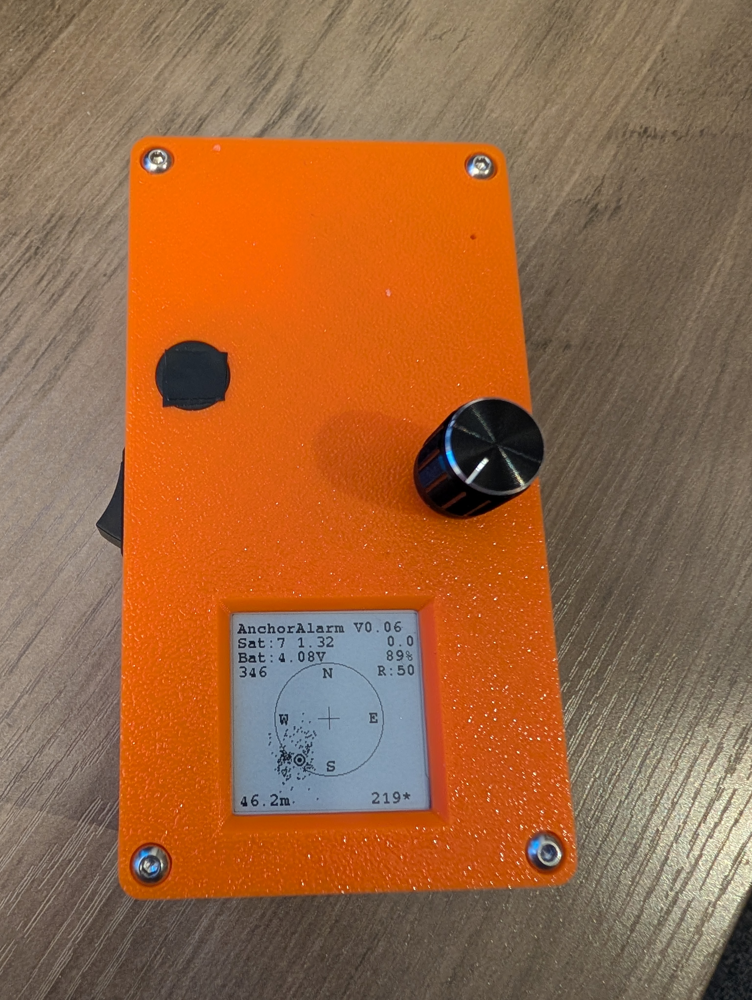
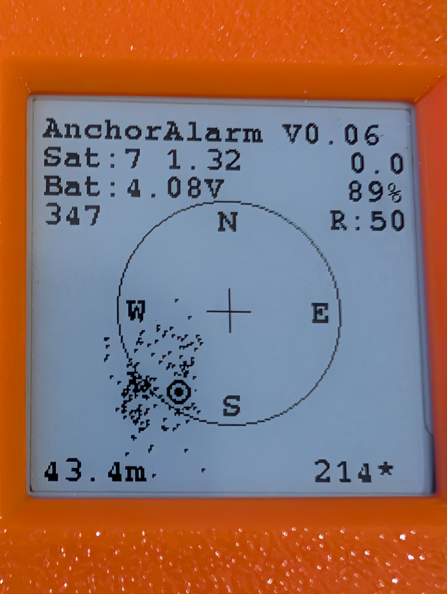
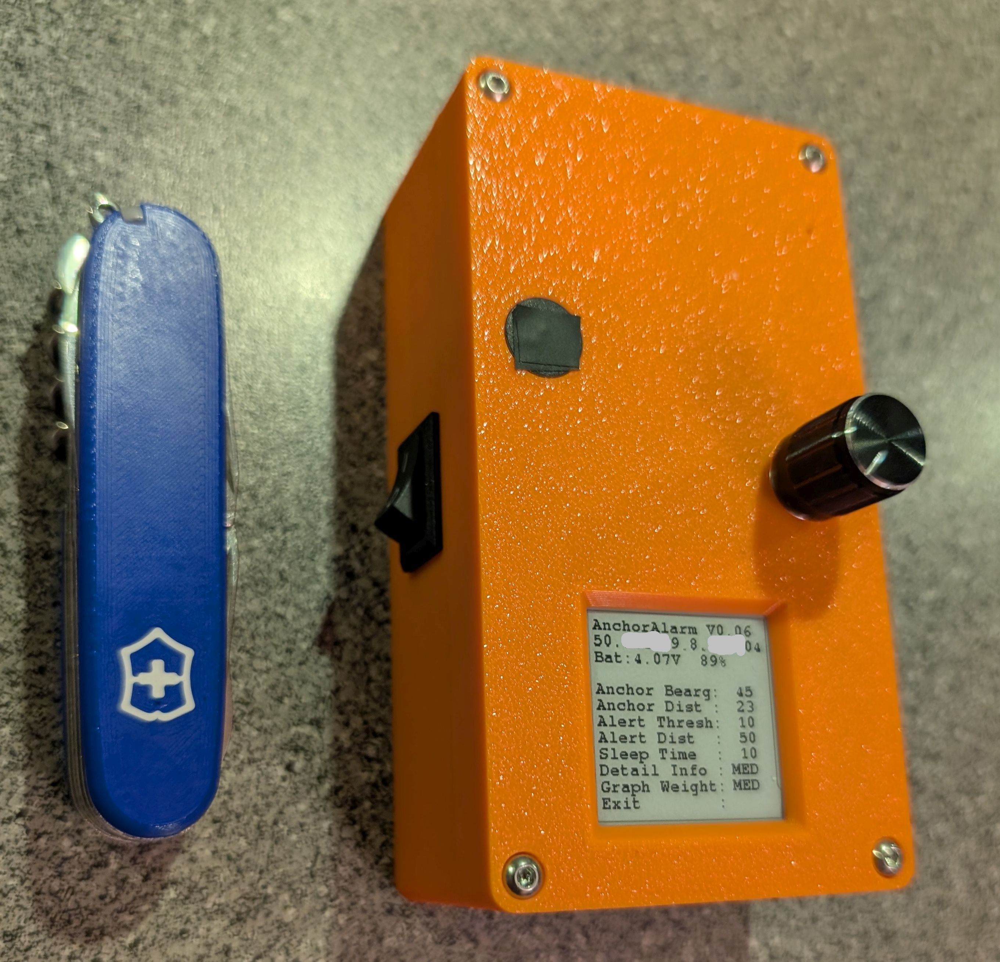
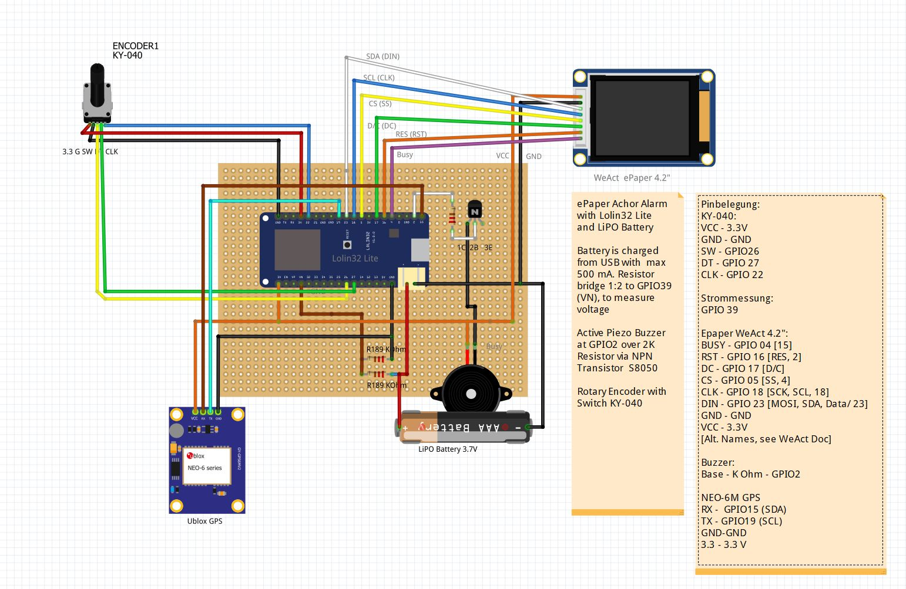

# ESP32_Anchor_Alarm
Anchor Alarm with LolinLite ESP32, GPS Module, ePaper Display and setting via rotary encoder

At anchor we like to use an anchor alarm app on the mobile phone. Unfortunately that one has a few disadvantages: it uses up the battery quickly, and sometimes Android likes to stop the app for mysterious reasons, particularly if it is not in the front and the screen on. We could also use nachor alarms embedded in other onboard electronics (e.g. AIS), but I find that to inflexible and using too much energy from our precious house batteries.

Thatˋs why I have come up with an alternative, an GPS based anchor alarm with LiPo battery and an ePaper display. It is run by power saving variant of the ESP32 SOC, the Lolin Lite.

Main components:
- Lolin Lite ESP32: optimized for battery operation while still being inexpensive. It is optimized for battery operation, the module has a very low consumption in deep sleep.
- ePaper Display 1.54" with 200x200 resolution. Sufficiently large for the use case, very low power consumption and pretty good readabilty
- 1800 mAh LiPo battery: sufficient for 30 hours of operation (measured power consumption is 60 mA on avarage)
- NEO-6M GPS module
- Optional: active GPS antenna
- Rotary Encoder with button for settings
- PCB board: I have recycled a board for the ePaper barograph that I built earlier. I had a few ones left over, all the required pins are exposed (some not properly labeled...)
- 3D printed housing

## Using the Anchor Alarm
Switch on with the toggle switch on the side.
The device will go through a few selftests (including some beeps) 
Then the main menu is shown. Rotate the knob to move through the menu or change values, press it to select.

1: Program name and version 
2: Present GPS position in decimal notation 
3: Battery voltage and percentage 
5: Anchor Bearing - True compass bearing from boat to anchor 
6: Anchor Distance - Distance from boat to anchor om meters 
7: Alert Threshold - Numeric value that determines how often and how far the boat must be out of the safe circle before an alert is triggered. 10% out of the circle adds 1, 30% out of the circle adds 3 and so on. If the sum of these values is bigger than the Alert Threshold, the alert is triggered 
8: Alert Distance - Radius of the safe circle around the anchor in meters  
9: Sleeptime - Time in seconds that the device sleeps between measurements (unless there is an alert, then it does not go to sleep) 
10: Detail Info - Determines how much data is shown in the watch (routine) screen 
11: Graph Weight - Determines how thick the lines and symbols are drawn in the watch screen 
12: Power Saving Mode - Determines how aggressive power saving is applied
12: Exit: Exit the menu, change to measurement screen and starts the watch 

The watch screen shows the anchor at the center (cross), the safe circle around it and the boat as a "target" in relation to the anchor. Depending on the detail info selected, further information is shown:
- Anchor positon (top) and boat position (bottom). Previous position are shown as dots, size depending on the setting "Graph Weight".
- Number of satellites and HDOP of GPS
- Accumulated alert value (if bigger then Alert Threshold: Alert is triggered)
- Measurement Counter, how often did the device wake up and checked the position
- Battery voltage and percentage
- Distance from and bearing from initial anchor position to boat. (If the boat is SW of the anchor position, the bearing is 235°)

## Power Saving Modes
Since the device has limited battery capacity, power saving is available. Thre modes can be switched in the setup menu. Depending on the GPS module which is installed, different measures are taken:
| Mode          | NEO-6M                      | NEO-M8N                      |
| ------------- | -------------               | -------------                |
| MIN           | 80 MHz, NMEA Msg, Ped       | 80 MHz, NMEA Msg, Ped        |
| MID           | 80 MHz, NMEA Msg, Ped, PSM  | 80 MHz, NMEA Msg, Ped, PM2   |
| MAX           | 80 MHz, NMEA Msg, Ped, PM2  | 80 MHz, NMEA Msg, Ped, HF Off|

* 80 MHz: Reduce clock frequency for ESP32 from 240 to 80 MHz
* MEA Msg: Switch off all NMEA messages that are not neede. ONly RMC, GGA, GLL are left on (CFG-MSH
* Ped: Switch the GPS module to pedestrian mode, for better precision at slow speeds (CFG-NAV5)
* PSM: Switch GPS Module to PowerSavineMode (CFG-RXM)
* PM2: Configure extended Power Management to longer updatePeriod (CFG-PM2)
* HF Off: Switch off the GPS module HF section (CFG-RST). Biggest savings, but required time to re-acquire satellites

The effect of power saving (80 MHz) reduces the ESP32 power consumption to ca. 75 mA while not in deep sleep.
The power consumption of the NEO-M8N is reduced to 45 mA in "MIN" mode to 28 mA in "MAX" mode
Precision of position is better in MIN mode than in MAX mode - depending on the quality of satellite data.

## Alert condition 
An alert is triggered if any of the following conditions is true:
- The present boat positon if too far from the original anchor position. Mathematical: (alert value) > (alert threshold). The alert value is accumulated over multiple runs: 10% out of the circle adds 1, 30% out of the circle adds 3 and so on. If the alert threshold is 10, an alert is triggered if the boat is out of the safe circle by more than 100% of the circle radius, or three times in sequence more than 33.3%, or ten times in sequence more than 10%. Whenever the boat returns into the safe circle, alert value is reset to 0.
- No valid GPS position for more than 10 seconds. This is reset as soon as a valid GPS position has been found again
- Battery voltage drops below 3.6V or battery percentage drops below 10%. Even with low voltage the device continues to work, until the battery protection kicks in

An alert can be silenced by pressing the button of the rotary encoder, the device then goes to the menu screen. 

## Schematic
Presently the schematic is available as Fritzing file. 

## Electrical Connections:
| KY-040| .     |
| ----- |------ |
| VCC | 3.3V |
| GND | GND |
| SW  | GPIO26 |
| DT  | GPIO 27 |
| CLK | GPIO 22 |

|Voltage measurement | .   |
| ----- | ------ |
| GPIO | 39 |

| Epaper | .   |
| ----- | ------ |
| BUSY | GPIO 04 [15] |
| RST  | GPIO 16 [RES, 2] |
| DC   | GPIO 17 [D/C] |
| CS   | GPIO 05 [SS, 4] |
| CLK  | GPIO 18 [SCK, SCL, 18] |
| DIN  | GPIO 23 [MOSI, SDA, Data/ 23] |
| GND  | GND |
| VCC  | 3.3V |

| Buzzer  | .   |
| -----   | ------ |
| Base    | via 2 K Ohm -> GPIO2 |

| NEO-6M / M8N GPS | .   |
| -----            | ------ |
| RX               |  GPIO15 (SDA) |
| TX               | GPIO19 (SCL) |
| GND              | GND |
| 3.3              | 3.3 V |

## PCB - Printed Circuit Board
For my first trials I have re-used a board that I previously used for another project. It does not fit exactly, but all required GPIOs are exposed.
ePaper: is connected as intended
Buzzer: is connected as intended via a S8050 transistor. The base is connected via a 2K resistor to GPIO2
NEO-6M GPS module: the connection initially intended for I2C is used (3.3V, GND, GPIO 15 (labeled SDA) and GPIO19 (labeled SCL)
KY-040 rotary encoder: is connected to 3.3V and GND via a OneWire connector, and to GPIOs 22,26 and 27 via the unmarked spare connectors on the left side of the Lolin Lite board

## Housing
Housing is 3D printed using PLA filament. The STL files for the print are included in the directory "STL"

## Disclaimer
This project is a personal hobbyist project and is provided for educational and experimental purposes only.

All hardware designs, software, firmware, and documentation are provided “as is” and “as available”, without any warranties, express or implied, including but not limited to warranties of merchantability, fitness for a particular purpose, or non-infringement.

The authors and contributors shall not be held liable for any direct or indirect damages, including but not limited to hardware damage, data loss, personal injury, fire, electrical hazards, or legal issues arising from the use, misuse, or inability to use this project.

This project is not intended for use in safety-critical, medical, automotive, industrial, or commercial applications.

You are solely responsible for verifying the correctness, safety, and suitability of this project for your use case, as well as ensuring compliance with all applicable laws, regulations, and standards.

Use this project at your own risk.
